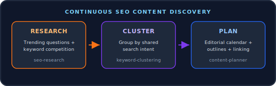

<h1 align="center">SEO Opportunity Finder</h1>

<p align="center">
  Continuously discovers content worth creating for a niche or website.<br/>
  Turns trending keyword research into a full editorial calendar with outlines and internal links.
</p>

<p align="center">
  
</p>

<p align="center">
  
</p>

<p align="center">
   
</p>
<p align="center">
   
</p>
<p align="center">
   
</p>

## Table of Contents

- [Overview](#overview)
- [Features](#features)
- [Requirements](#requirements)
- [Installation](#installation)
- [Configuration](#configuration)
- [Usage](#usage)
- [Folder Structure](#folder-structure)

## Overview

Continuously discovers content worth creating for a niche or website. A three-stage pipeline researches trending questions and scores keyword competition, clusters the results into content topics, then turns those clusters into an editorial calendar with blog outlines, suggested titles, and internal linking recommendations. Runs entirely on free, built-in Zo tools and already-connected catalog integrations, no paid third-party SEO API required.

## Features

| Skill | What it does |
| --- | --- |
| `seo-research` | Trending-question research via web search, deep research, and X/Twitter discourse; heuristic low-competition keyword scoring; optional Google Search Console pull for underperforming queries on a website you own. |
| `keyword-clustering` | Groups raw research into topic clusters by shared search intent, each with a primary keyword, supporting variants, and a rolled-up competition score. |
| `content-planner` | Turns clusters into an editorial calendar, blog outlines, titles, and internal-linking recommendations; hands off to `content-plan-builder` / `content-plan-editor` for execution. |

## Requirements

- Built-in web search / research tools (`web_search`, `web_research`, `x_search`), no setup needed.
- Optional: Google Search Console catalog integration, only used when analyzing a website you own (adds real query/impression data). No other integration or API key is required or supported, this pipeline never calls a paid third-party SEO API.

## Installation

### Fast path (recommended)

1. Open a **new Zo chat**.
2. Paste the entire contents of `file installation-prompt.md` from this repo, with the repo URL filled in (it defaults to `https://github.com/robort-gabriel/seo-opportunity-finder`, swap it if you're installing from a fork).
3. Send it. The AI will fetch this repo into `Zo-Automations/seo-opportunity-finder/` on your Zo, verify the three skills, create a dedicated "SEO Opportunity Finder" persona scoped to this project, and ask whether to run the pipeline ad hoc and/or schedule it as a recurring automation, confirming with you before creating anything that runs unsupervised.

This is the whole install: no packages, no build step, no API keys.

### Manual path

If you'd rather install by hand:

1. Clone or download this repo.
2. Copy the whole folder into your Zo workspace at `/home/workspace/Zo-Automations/seo-opportunity-finder/`, preserving the structure below. The three skills must stay project-local at `Skills/seo-research/`, `Skills/keyword-clustering/`, `Skills/content-planner/`, they are not installed globally, and moving them elsewhere breaks the project's scoping.
3. (Optional) In a chat, ask Zo to create a persona for this project using the exact text in `file persona.md` so you don't have to restate the pipeline every time.
4. (Optional) Connect Google Search Console under Integrations if you want site-specific query data for a website you own, this is the only optional integration; no other API key is required or supported.
5. Try it: paste one of the examples from `file starter-prompts.md` into a chat.

## Configuration

No secrets required. Per-run parameters, passed stage to stage:

| Parameter | Required | Default | Used by |
| --- | --- | --- | --- |
| `niche_or_website` | Yes | — | `seo-research` |
| `pieces` | No | `5` | `keyword-clustering` |
| `cadence` | No | `weekly` | `content-planner` |
| `website` | No | — | `content-planner` (internal linking, only when analyzing a site you own) |

## Usage

**Ad hoc:** ask for each stage in sequence, or ask for the full pipeline in one request (see `file starter-prompts.md`). The stages hand off through files:

```markdown
seo-research        -> Content/SEO-Opportunities/<slug>/<date>/raw-research.md
keyword-clustering  -> Content/SEO-Opportunities/<slug>/<date>/clusters.md
content-planner      -> editorial-calendar.md, blog-outlines.md, titles.md, internal-linking.md
```

**Recurring:** create a scheduled agent using `file automation-prompt.md` as the instructions, with `niche_or_website` filled in and a run frequency (e.g. weekly). Scheduling a recurring agent is not done automatically by this project, confirm the frequency and set it up explicitly, since each run is a full Zo session.

## Folder Structure

```markdown
Zo-Automations/seo-opportunity-finder/
├── README.md
├── installation-prompt.md            # paste into a new chat to auto-install everything
├── persona.md                        # exact text for the dedicated "SEO Opportunity Finder" persona
├── automation-prompt.md              # instructions for the scheduled agent
├── starter-prompts.md                # example prompts
├── assets/
│   ├── pipeline-diagram.svg          # README header pipeline diagram
│   └── zo-logo.png                   # Zo Computer logo used in this README
└── Skills/
    ├── seo-research/
    │   └── SKILL.md
    ├── keyword-clustering/
    │   └── SKILL.md
    └── content-planner/
        ├── SKILL.md
        └── references/
            └── templates.md          # output file templates
```